# coven-github Design

`coven-github` is a thin GitHub ingress layer for trusted familiar work. It should not become a generic agent platform inside the GitHub App. The GitHub App accepts repository events, routes them to the right familiar, records task state, and keeps humans in control through Cave oversight.

For a visual system map, webhook sequence, task lifecycle, and trust-boundary diagrams, see [Architecture Diagrams](docs/architecture.md).

## Design Goal

Assign GitHub work to a known familiar and get a draft PR back with visible context, evidence, and an oversight path.

The core design constraint is trust continuity:

- The same familiar can return to the same repository with memory and team context.
- The team can see what the familiar used, changed, tested, and could not decide.
- The service can fail transparently without losing task state.
- The open-source adapter remains self-hostable so buyers can inspect the trust boundary.

## Task Flow

```mermaid
flowchart LR
    event[GitHub event]
    hmac[Webhook HMAC validation]
    route[Event parsing and familiar routing]
    task[Task record and queue]
    worker[Worker starts isolated session]
    brief[coven-code receives session brief]
    result[Familiar drafts changes and result envelope]
    github[GitHub Check Run and PR updated]
    cave[Cave Board and session link expose oversight]

    event --> hmac --> route --> task --> worker --> brief --> result --> github --> cave
```

## Routing Model

The initial self-hosted adapter uses TOML familiar config:

- `bot_username` routes issue assignment and mentions.
- `trigger_labels` route issue labels such as `coven:fix`.
- `skills` and `model` shape the familiar runtime.

Hosted routing should move this into installation-scoped configuration:

- installation id,
- organization,
- repository,
- familiar id,
- allowed trigger labels,
- memory scope,
- skill pack,
- model route,
- autonomy tier.

## Cave Oversight Gate

Cave oversight is the control plane. It should show:

- task status and terminal state,
- familiar identity,
- repository and issue/PR links,
- Check Run link,
- session link,
- context and memory scope used,
- evidence collected,
- human decision points.

Draft PRs are the default. The team should promote more autonomy only after the familiar earns trust through repeated visible work.

## Operational Pattern

ClawSweeper is the reference pattern for conservative GitHub automation inside the OpenClaw ecosystem: narrow promises, durable state, marker-backed comments edited in place, explicit maintainer commands, and deterministic gates before repair or merge work.

`coven-github` should borrow the operating style without becoming the same product:

- Keep one visible status surface per task instead of noisy repeated comments.
- Treat maintainer commands as clear steering inputs, not casual chat.
- Store durable task records before worker execution starts.
- Re-check live GitHub state immediately before every mutation.
- Prefer proposal, draft PR, and Cave approval loops before any higher-autonomy behavior.
- Make status, evidence, and next action obvious to reviewers who never open Cave.

The familiar layer adds the moat: a known teammate with repo and team context. The ClawSweeper pattern supplies the operational discipline that makes that familiar safe to trust.

## Trust Boundaries

| Boundary | Rule |
|---|---|
| Webhook ingress | Validate HMAC before parsing or routing. |
| Tenant data | Scope task state by GitHub installation before hosted launch. |
| Worker execution | Run each task with a timeout and isolated workspace. |
| Git auth | Use installation tokens, not user credentials. |
| Memory | Make familiar memory opt-in, inspectable, and revocable. |
| Comments | Ignore familiar bot self-comments to avoid loops. |
| Output | Prefer draft PRs and explicit failure states. |

## Hosted Reliability Requirements

Hosted `coven-github` needs these before paid beta:

1. Durable queue.
2. Persistent task store.
3. GitHub delivery idempotency.
4. Tenant-scoped task API auth.
5. Installation-scoped familiar routing.
6. Worker isolation and timeout enforcement.
7. Audit events for accepted, started, retried, timed out, failed, needs input, PR opened, and completed.

## Why This Design Monetizes

The paid product is not "an agent that can write code." The paid product is a managed trust pipeline:

- Teams keep familiar context instead of re-explaining their standards.
- Managers get visibility instead of hidden automation.
- Security reviewers get a self-host path and a clear credential boundary.
- Engineers get PRs from a known actor with a history.

That is what generic GitHub bots and one-shot coding agents do not provide.
