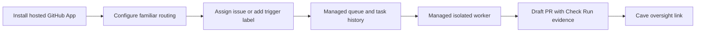

# Hosted OpenCoven for GitHub

Hosted OpenCoven is the managed version of `coven-github`: install the GitHub App, configure a familiar, assign an issue or label, and get a draft PR back with Cave oversight.

The hosted tier should monetize managed reliability and familiar continuity, while the open-source adapter remains self-hostable for trust and inspection.

See [Architecture Diagrams](docs/architecture.md) for the hosted vs self-hosted deployment diagram and trust-boundary map.

The lightweight TypeScript webhook deployment bundle now lives in
[`OpenCoven/coven-github-webhook`](https://github.com/OpenCoven/coven-github-webhook).
It uses this repo's GitHub App manifest and headless contract, then maps
installation/repository IDs to familiar routes through a local JSON policy.

## Hosted Flow

## What Hosted Adds

| Capability | Self-hosted adapter | Hosted OpenCoven |
|---|---|---|
| GitHub App ingress | You run it | Managed |
| Queue | Durable SQLite queue built in | Managed durable queue |
| Task state | Persistent across restarts (SQLite) | Persistent history at fleet scale |
| Worker isolation | Operator-managed | Managed worker pool |
| Familiar routing | Installation/repo scoped via `[[installations]]` TOML | Same policy via the hosted control plane |
| Familiar memory | Local/operator-managed | Optional cloud memory |
| Cave oversight | Local Cave | Hosted-ready oversight links and dashboard |
| Usage limits | Operator-managed | Tiered limits and audit logs |
| Support | Community | Priority by tier |

## Packaging

| Tier | Buyer | Initial shape |
|---|---|---|
| Open / Self-host | OSS maintainers, security reviewers, local-first users | Free adapter, BYOM, one familiar, community support. |
| Hosted Starter | Small teams with backlog | Managed queue, one familiar, task caps, Cave oversight links. |
| Hosted Team | Product/platform teams | Multi-familiar routing, audit log, usage controls, priority queue, team memory. |
| Hosted Dedicated | Security-sensitive orgs | Dedicated workers, stronger retention controls, custom limits, SLA, onboarding support. |

Launch with flat monthly tiers and task caps. Avoid pure usage billing until task duration and model-cost distribution are known. The concrete tier matrix, launch price proposal, and the enforcement mechanism behind every promised limit live in [docs/pricing.md](docs/pricing.md).

The adapter enforces purchased plans directly: GitHub Marketplace
`marketplace_purchase` webhooks record each account's plan, `installation`
events map installations to their account, and intake plus the worker apply
the tier's task caps and concurrency automatically. `[billing] require_plan`
turns the hosted deployment into a paid gate — installations without an
entitled plan (and no explicit `[[installations]]` entry) are recorded
`ignored:no_plan`. Explicit TOML limits always win, which is how Dedicated
contracts get custom numbers.

## Buyer Promise

> Your familiar on your GitHub: the one that already knows your code, your team, and how you ship.

The strongest buyer promise is trust continuity. A familiar should know the diff between "works" and "good enough for this repo." Hosted makes that reliable without making the customer operate workers, queues, or task history.

## Data Boundaries

Hosted should make these boundaries explicit before beta:

- GitHub installation tokens are scoped to the installed repositories.
- User GitHub credentials are not used for worker pushes.
- Familiar memory is opt-in and scoped by installation/repository policy.
- Task history records metadata, status, evidence, links, and summaries.
- Raw repository workspaces are temporary and destroyed after the task.
- Secrets are redacted from logs and task output.

## Beta Gate

Hosted beta should wait for:

1. Persistent task store.
2. Durable queue.
3. Tenant-scoped task API authentication.
4. Worker isolation with cleanup and timeouts.
5. Usage metering by installation, repo, familiar, and task.
6. Cave oversight dashboard for task history and human intervention.

All six code gates are shipped. The operational side — provisioning, TLS
ingress, continuous store backup, monitoring, restore drills, upgrades — is
the [hosted deployment runbook](docs/hosted-deploy.md) with its stack in
[`deploy/hosted/`](deploy/hosted/).

## Landing Page Copy

Headline:

> Assign it like a teammate. Get a PR back.

Support copy:

> OpenCoven lets your team deploy a trusted familiar to GitHub. It knows your repo context, follows your skills and review norms, drafts PRs under Cave oversight, and gets better as it works with your team.

Primary CTA:

- Join hosted beta

Secondary CTA:

- Self-host the adapter
