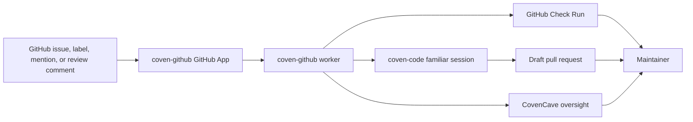
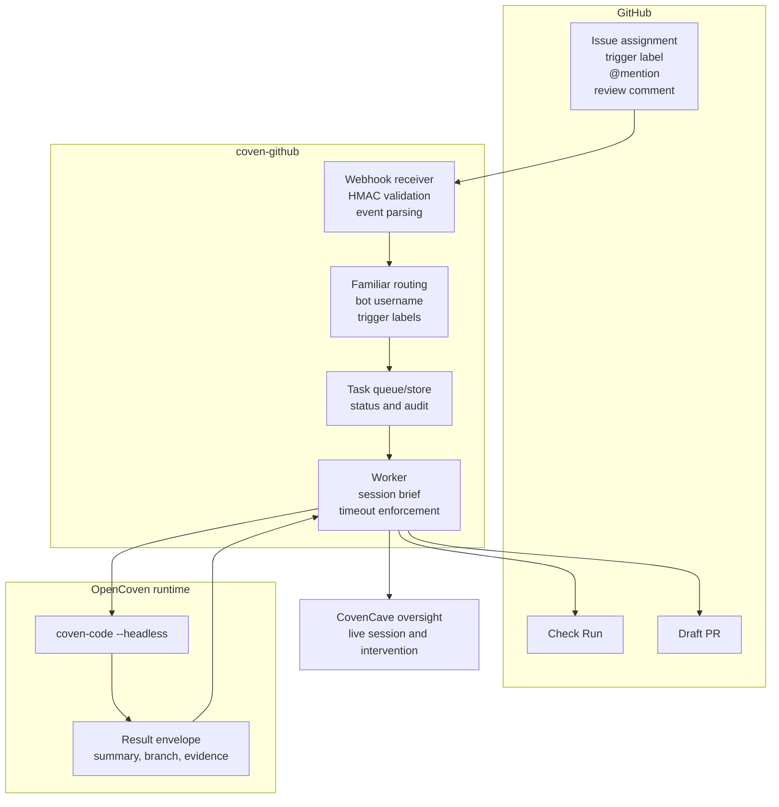

# coven-github

**Assign an issue to your familiar. Get a PR back.**

`coven-github` is the GitHub App adapter for [OpenCoven](https://opencoven.ai). It routes GitHub issues, labels, mentions, and review comments into a Coven familiar, then publishes progress through Check Runs, issue comments, draft PRs, and CovenCave session links.



---

## What it does

- Accepts GitHub App webhook deliveries and verifies their HMAC signature.
- Routes configured triggers to a familiar by bot username or label.
- Runs `coven-code --headless` with a tokenless session brief.
- Posts Check Run state, direct Cave session links, and draft PRs when the run produces commits.

See [Architecture Diagrams](docs/architecture.md), [Design](DESIGN.md), [Hosted OpenCoven](HOSTED.md), [Familiar Contract](FAMILIAR-CONTRACT.md), [Roadmap](ROADMAP.md), and [Hosted vs self-hosted](docs/hosted-vs-self-hosted.md) for the operational plan.

---

## Architecture



For deeper system, sequence, state, security-boundary, and hosted deployment diagrams, read [docs/architecture.md](docs/architecture.md).

### Components

| Component | Location | Role |
|---|---|---|
| `crates/webhook` | this repo | Webhook receiver: HMAC validation, event parsing, queue publish |
| `crates/worker` | this repo | Task runner: spawns coven-code, streams progress, posts Check Runs |
| `crates/github` | this repo | GitHub API client: installations, Check Runs, PRs, comments |
| `crates/config` | this repo | Familiar config, installation registry, model routing |
| `coven-github-webhook` | [OpenCoven/coven-github-webhook](https://github.com/OpenCoven/coven-github-webhook) | TypeScript deployment bundle for the hosted/self-hostable webhook entrypoint |
| `coven-code` | [OpenCoven/coven-code](https://github.com/OpenCoven/coven-code) | Execution runtime (headless mode) |
| `CovenCave` | [OpenCoven/coven-cave](https://github.com/OpenCoven/coven-cave) | Oversight UI |

---

## Triggers (V1)

| Trigger | Action |
|---|---|
| Issue assigned to bot user (`@cody`) | Agent picks up issue, opens PR |
| `coven:` label applied to issue | Same as above |
| `@cody` mention in issue comment | Agent responds / iterates |
| PR review comment `@cody fix:` | Agent addresses review feedback |

---

## Status

🚧 **In development.** The repo has the first GitHub App adapter path wired, but hosted production readiness is still being built. See [COVEN-GITHUB.md](COVEN-GITHUB.md) for the roadmap-level product spec.

| Capability | Status | Notes |
|---|---|---|
| Webhook HMAC validation | Implemented | Rejects unsigned or invalid GitHub webhook payloads. |
| Issue assignment trigger | Implemented | Routes matching bot assignees to configured familiars. |
| Label trigger | Implemented | Routes configured `trigger_labels` such as `coven:fix`. |
| Issue / PR mention trigger | Implemented | Ignores familiar bot self-comments to avoid loops. |
| GitHub App installation tokens | Implemented | Mints installation access tokens from the App private key. |
| Check Run creation and completion | Partial | Creates and updates Check Runs against the resolved target head SHA; stale-ref revalidation before publish is still planned. |
| Headless execution contract | Locked (v1) | Brief, result envelope, exit codes, and git-auth channel are pinned in [`docs/headless-contract.md`](docs/headless-contract.md) with JSON Schemas, golden fixtures, and a conformance test. |
| `coven-code --headless` execution | Partial | Worker spawns headless sessions with a tokenless session brief and enforces task timeouts; result quality depends on the runtime. |
| Pull request creation | Partial | Opens draft PRs from session results against the repository's resolved default/base branch. |
| CovenCave task polling | Partial | In-memory task API exists for local oversight; hosted control-plane auth and persistence are planned. |
| Durable queue / task store | Planned | Required for hosted reliability and restarts. |
| Hosted tier | Planned | See [Hosted vs self-hosted](docs/hosted-vs-self-hosted.md). |
| Familiar trust contract | Planned | See [Familiar Contract](FAMILIAR-CONTRACT.md). |

---

## Self-hosting

```bash
# Clone and build
git clone https://github.com/OpenCoven/coven-github
cd coven-github
cargo build --release

# Configure
cp config/example.toml config/local.toml

# Fill in config/local.toml, then validate it.
# doctor prints one next step for every error or warning.
./target/release/coven-github doctor --config config/local.toml

# Run
./target/release/coven-github serve --config config/local.toml
```

Prefer containers? A multi-stage [`Dockerfile`](Dockerfile) and
[`compose.yaml`](compose.yaml) ship in the repo root.

See [docs/self-hosting.md](docs/self-hosting.md) for GitHub App registration, permissions, smoke tests, and troubleshooting. For a minimal familiar route, start from [`examples/familiar-github-starter`](examples/familiar-github-starter/).

For a lightweight TypeScript deployment entrypoint that follows this app
contract, use
[`OpenCoven/coven-github-webhook`](https://github.com/OpenCoven/coven-github-webhook)
with its `config/example-policy.json` and connection guide.

---

## Sponsor / Hosted Tier

`coven-github` is open source and self-hostable. OpenCoven offers a **hosted tier** for organizations that want managed infra, cloud familiar memory, and multi-familiar routing without running their own workers.

See [Hosted OpenCoven](HOSTED.md) and [Hosted vs self-hosted](docs/hosted-vs-self-hosted.md) for the service shape, security boundaries, and buyer packaging.

---

## Related

- [coven-code](https://github.com/OpenCoven/coven-code) — execution runtime
- [coven-github-webhook](https://github.com/OpenCoven/coven-github-webhook) — TypeScript webhook deployment bundle
- [coven-cave](https://github.com/OpenCoven/coven-cave) — oversight UI
- [cast-codes](https://github.com/OpenCoven/cast-codes) — local IDE with CastAgent

---

## License

GPL-3.0 — see [LICENSE](LICENSE).
