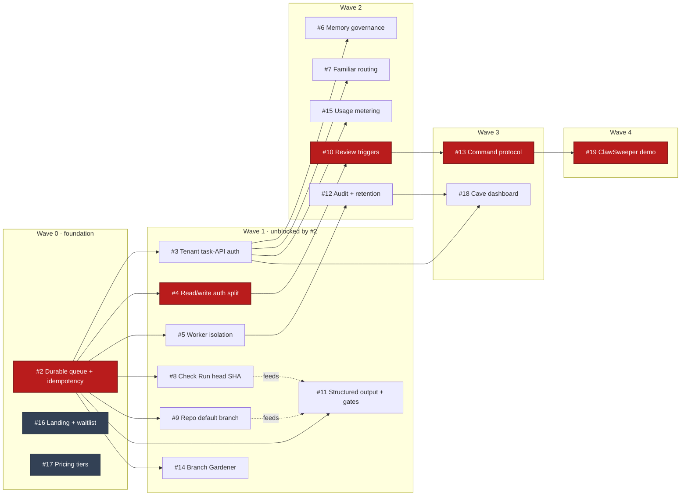

# coven-github Roadmap

This roadmap operationalizes `coven-github` as a hosted service funded by teams that want trusted familiar-driven GitHub work.

## Strategic Thesis

The market already has generic coding agents. OpenCoven's advantage is the familiar:

- A known teammate, not a disposable bot.
- Context-aware across repos, issues, reviews, and team norms.
- Governed by skills, memory, and a visible trust contract.
- Watched and steered through Cave instead of hidden in a black box.

The hosted product should monetize managed reliability and trust continuity: durable task infrastructure, worker isolation, auditability, familiar memory, and multi-familiar routing.

## Milestone 1: Honest Self-Hosted Adapter

Goal: a motivated user can run the adapter and understand exactly what works. **Shipped** — tracked as closed backfill issues #20–#24.

- Implement issue assignment, label, issue mention, and PR review comment triggers. (#20)
- Enforce webhook HMAC validation and bot self-comment suppression. (#21)
- Enforce worker timeout behavior. (#22)
- Keep README status honest about implemented, partial, and planned capabilities. (#23)
- Publish security, isolation, self-hosting, hosted-vs-self-hosted, and familiar contract docs. (#24)

## Milestone 2: Hosted Control Plane

Goal: support real hosted installations without losing task state or leaking tenant context.

- Persistent task store. (#2)
- Durable queue. (#2)
- GitHub delivery idempotency. (#2)
- Installation-scoped familiar routing. (#7)
- Tenant-scoped task API auth for Cave. (#3)
- Split agent read auth from publication write auth. (#4)
- Hosted familiar memory governance contract between coven-github and coven-code. (#6)
- Task audit log and terminal states. (terminal states #2; audit controls #12)
- Marker-backed GitHub status comments that are edited in place per task. (#13)
- Maintainer command router for status, stop, retry, explain, and approve. (#13)
- **Branch Gardener** — scheduled branch hygiene skill: classify branches, delete dead ones, open draft PRs for PRless work, report to Cave. See [`docs/branch-gardener.md`](docs/branch-gardener.md). (#14)

## Milestone 3: GitHub Correctness

Goal: make the GitHub App reliable across normal repositories.

- Resolve repository default branch through the GitHub API. (#9)
- Resolve Check Run head SHA instead of using placeholders. (#8)
- Use the repo default branch for PR base and session brief. (#9)
- Capture review-comment diff hunk context and structured review output. (#11)
- Add transient GitHub API retry classification.
- Implement PR, push, and commit review triggers with webhook fixtures. (#10)

## Milestone 4: Hosted Worker Fleet

Goal: make familiar execution safe enough to charge for.

- Containerized worker backend. (#5)
- CPU, memory, disk, network, and timeout limits. (#5)
- Workspace cleanup guarantees. (#5)
- Token redaction and secret handling tests, artifact retention, and audit. (#12)
- Usage metering by installation, repo, familiar, and task runtime. (#15)
- Tier limits and concurrency controls. (#15)

## Milestone 5: Monetization Surface

Goal: make the value legible and buyable.

- `opencoven.ai/github` landing page and hosted beta waitlist. (#16)
- Pricing: Community, Hosted Starter, Hosted Team, Hosted Dedicated. (#17)
- Cave dashboard for task history, familiar routing, usage, and audit events. (#18)
- Demo assets: issue assignment to Check Run, draft PR back to issue, Cave oversight intervention. (#19)
- A reference demo showing the ClawSweeper-style operating loop: one visible status, explicit steering commands, durable audit trail, and familiar-specific PR output. (#19)

## Build Sequence & Dependencies

Native GitHub "blocked by" relationships gate these issues; the [backlog dependency DAG](docs/backlog-dag.md) (tracker #25) holds the full topological view with live status. Critical path:

`#2 → #4 → #10 → #13 → #19` — durable queue → auth split → review triggers → command protocol → reference demo.

Legend: red = critical path `#2 → #4 → #10 → #13 → #19` · slate = GTM (no code dependencies) · dashed = grooming "feeds" (not a native blocked-by edge).

Build waves (topological):

- **Wave 0 — foundation:** #2 unblocks all of M2/M3/M4. #16 and #17 are parallelizable with no code dependencies.
- **Wave 1 — unblocked by #2:** #3, #4, #5, #8, #9, #11, #14.
- **Wave 2:** #10 (needs #4); #6, #7, #15 (need #3); #12 (needs #5).
- **Wave 3:** #13 (needs #10); #18 (needs #3 and #12).
- **Wave 4:** #19 (needs #13).

#2 is the single chokepoint: every M2/M3/M4 engineering issue — including all four hosted paid gates (#5, #3, #7, #6) — sits within two hops of it. Sequence #2 first.

## Current Focus

The moat → hosted-V1 engineering backlog is drained — the operating-loop spine,
hosted control plane, GitHub correctness, and worker-fleet isolation have all
shipped (see the [backlog DAG](docs/backlog-dag.md) for the full ledger). What
remains is sequenced by the hosted beta gates and go-to-market, not code
dependencies:

1. **#14 Branch Gardener** — the last scheduled-hygiene skill (in progress).
2. **#16 (GTM)** — landing page + beta waitlist (pricing #17 has shipped —
   see [docs/pricing.md](docs/pricing.md)).
3. Harden toward the hosted beta gates in [HOSTED.md](HOSTED.md) and stand up
   the hosted control plane on top of the now-durable, tenant-scoped adapter.
