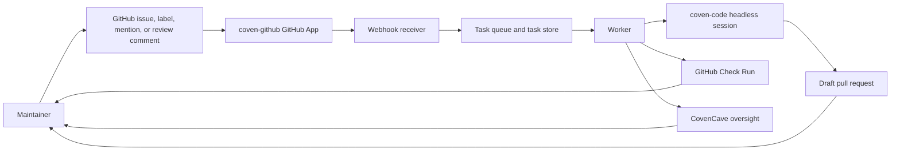
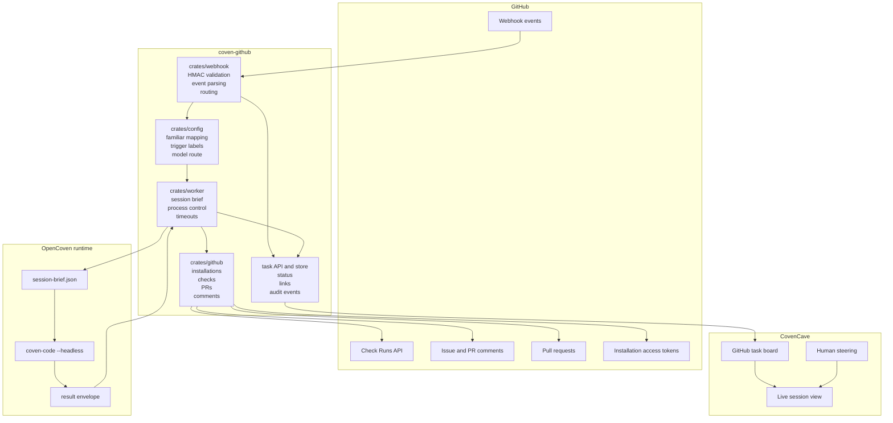
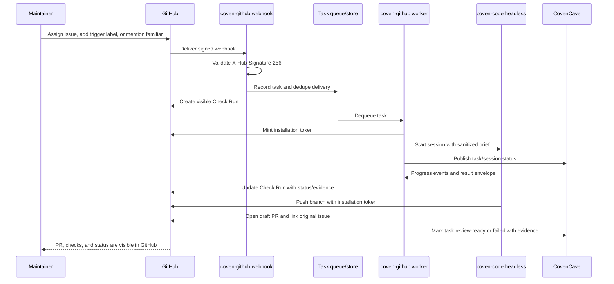
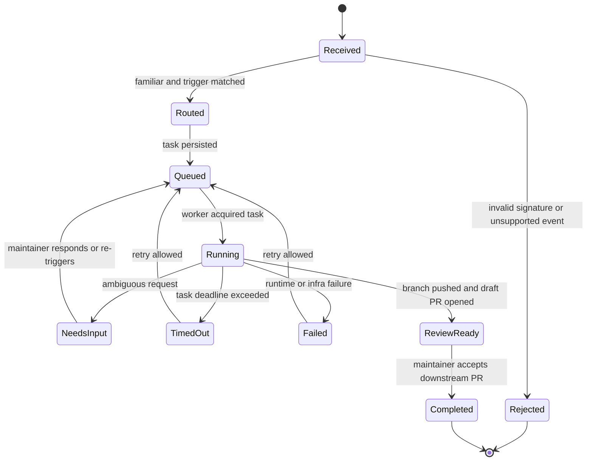
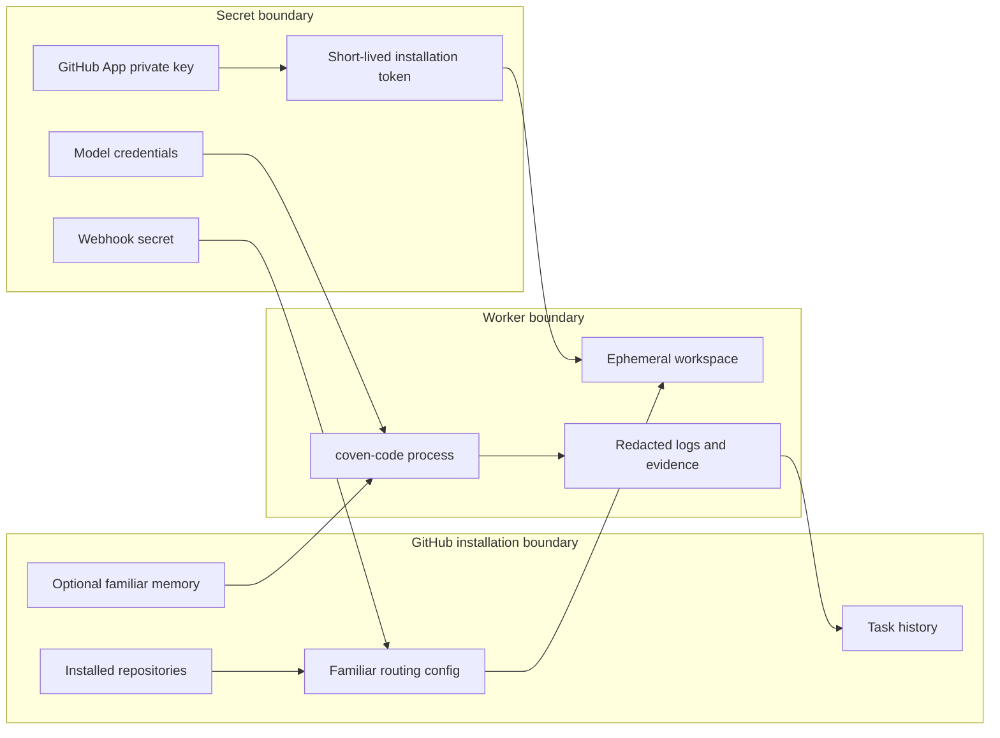
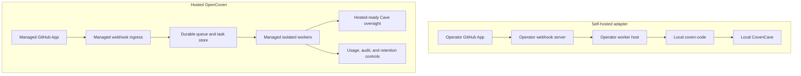

# Architecture Diagrams

This page gives a GitHub-rendered map of `coven-github`: what receives GitHub events, what runs familiar work, where humans watch progress, and where hosted reliability boundaries sit.

## At A Glance

`coven-github` is intentionally thin. It owns GitHub ingress, routing, task state, worker orchestration, and status surfaces. The familiar's execution quality lives in `coven-code`, while live oversight and intervention live in CovenCave.

## Component Map

## Webhook To Pull Request Sequence

## Task State Lifecycle

This lifecycle keeps GitHub quiet but visible: one task status, one Check Run, and draft PRs by default. No mutation should happen without re-checking live GitHub state first.

## Trust And Data Boundaries

Security rules:

- Validate webhook HMAC before parsing JSON.
- Scope all task state by GitHub installation before hosted launch.
- Use installation tokens, not user GitHub credentials.
- Keep worker workspaces per task and clean them up after completion or failure.
- Redact secrets from logs, task APIs, Check Runs, issue comments, and PR bodies.
- Make hosted familiar memory opt-in, inspectable, scoped, and revocable.

## Hosted Vs Self-Hosted Deployment

Self-hosting is the inspectable escape hatch. Hosted OpenCoven monetizes the operational burden: durable queues, task history, worker isolation, familiar memory, usage controls, and support.

## Where To Read Next

- [README](../README.md) for the product overview and quick start.
- [Design](../DESIGN.md) for product constraints and operating pattern.
- [Hosted OpenCoven](../HOSTED.md) for managed service packaging.
- [Security Model](security.md) for credential, token, worker, and tenant boundaries.
- [Self-hosting](self-hosting.md) for operator setup.
