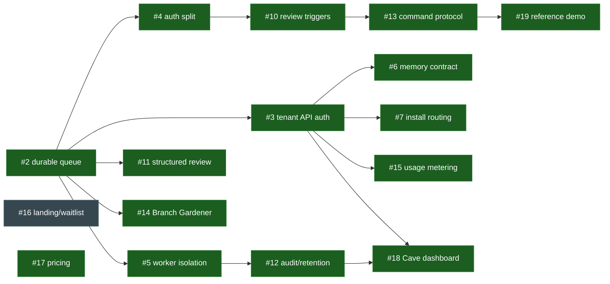

# Backlog dependency DAG and build order (issue #25)

The canonical, human-readable topological view of the moat → hosted-V1 backlog:
which issues gate which, the build waves, and — kept current here — what has
shipped. Native GitHub "blocked by" relationships encode the same edges; this
doc is the readable projection and the status ledger.

> **Status: the engineering spine and all of Waves 0–4 are shipped.** What
> remains is the GTM landing page (#16); pricing (#17) has landed. See
> [Current state](#current-state).

## Critical path (the spine) — ✅ complete

```
#2 → #4 → #10 → #13 → #19
```

Durable queue → auth split → review triggers → command protocol → reference
demo. Nothing in the operating loop could ship before #2; every link is now
merged.

## Build waves (topological, with status)

Legend: ✅ shipped · 🔧 in progress · 🔲 open (no code dependency).

**Wave 0 — foundation (no blockers)**
- ✅ **#2** Durable task queue + delivery idempotency — the root; unblocked all of M2/M3/M4
- 🔲 #16 Landing page + beta waitlist · ✅ #17 Pricing tiers *(GTM, parallelizable, no code deps)*

**Wave 1 — unblocked by #2**
- ✅ #3 Tenant-scoped task API auth
- ✅ #4 Split agent read auth from publication write auth
- ✅ #5 Hosted worker container isolation
- ✅ #8 Check Run head SHA / target ref
- ✅ #9 Repo default branch for brief + PR base
- ✅ #11 Structured review output + publication gates
- ✅ #14 Branch Gardener scheduled skill

**Wave 2**
- ✅ #10 PR/push/commit review triggers *(was blocked by #4)*
- ✅ #6 Hosted memory governance contract *(was blocked by #3)*
- ✅ #7 Installation-scoped familiar routing *(was blocked by #3)*
- ✅ #15 Usage metering + tier limits + concurrency *(was blocked by #3)*
- ✅ #12 Audit, artifact retention, redaction *(was blocked by #5)*

**Wave 3**
- ✅ #13 Marker-backed comments + command protocol *(was blocked by #10)*
- ✅ #18 Cave oversight dashboard *(was blocked by #3 and #12)*

**Wave 4**
- ✅ #19 ClawSweeper-style reference demo *(was blocked by #13)*

## Full edge list (blocked → blocking)

| Issue | Blocked by | Status |
|---|---|---|
| #3, #4, #5, #8, #9, #11, #14 | #2 | ✅ |
| #10 | #4 | ✅ |
| #6, #7, #15 | #3 | ✅ |
| #12 | #5 | ✅ |
| #13 | #10 | ✅ |
| #18 | #3, #12 | ✅ |
| #19 | #13 | ✅ |

Roots: **#2** (engineering spine) and #16/#17 (GTM, no code deps). The hosted
paid gates (#3, #5, #6, #7) all sat ≤2 hops from #2 and are now shipped.



## Current state

The moat → hosted-V1 engineering backlog is effectively complete:

- **Operating-loop spine** (#2 → #4 → #10 → #13 → #19): shipped.
- **Hosted control plane** — tenant-scoped API + auth (#3), installation routing
  (#7), usage metering/limits (#15), memory governance (#6), audit/retention/
  redaction (#12), Cave oversight dashboard (#18): shipped.
- **GitHub correctness** — head-SHA/target-ref (#8), default-branch resolution
  (#9), structured review output + publication gates (#11): shipped.
- **Hosted hygiene** — Branch Gardener scheduled branch cleanup (#14): shipped.
- **Hosted worker fleet** — container isolation + resource limits (#5): shipped.

**Remaining:**

- 🔲 **#16 (GTM)** — landing page + beta waitlist; no code dependency, sequenced
  by go-to-market rather than the DAG. Pricing (#17) has shipped.

With the code DAG drained, sequencing is now driven by the hosted beta gates
(see [HOSTED.md](../HOSTED.md)) and GTM rather than inter-issue blockers.
