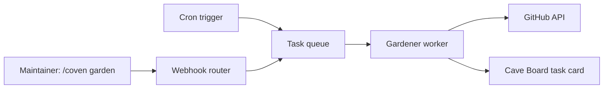

# Branch Gardener

`branch-gardener` is a built-in skill for `coven-github` that keeps a repository's
branch list tidy on a schedule.

It automates the pattern of: scan every branch → classify it → merge PRless active
work → delete merged or dead branches → report to Cave. The gardener never deletes
without evidence and never merges without a PR.

---

## Problem

Active OpenCoven repositories accumulate branches rapidly. Codex agents, familiar
worktrees, and exploratory work all leave behind branches at different life stages:

- **Active** — unmerged commits, possibly a PR open, work in progress
- **PRless** — unmerged commits, no PR yet; waiting to be surfaced
- **Dead** — zero commits ahead of main; merged or abandoned
- **Scratch** — detached worktrees, `/tmp` checkouts, no associated branch

Without a regular sweep these pile up into dozens of stale branches that make `git
branch -a` noisy and obscure what is actually in flight.

---

## What the Gardener Does

Each run follows four steps in order:

```
1. Scan      — list all remote branches and classify each one
2. Prune     — delete branches with 0 commits ahead of default branch
3. Surface   — open draft PRs for active branches that have no PR yet
4. Report    — post a Cave Board task card summarising the run
```

The gardener never takes a destructive action on a branch with unmerged commits.
It only opens PRs (proposing review) and deletes branches that are definitively
dead (0 commits ahead).

---

## Branch Classification

| Class      | Condition                                       | Action           |
|------------|-------------------------------------------------|------------------|
| `dead`     | 0 commits ahead of default branch              | auto-delete      |
| `prless`   | ≥1 commits ahead, no open PR                  | open draft PR    |
| `active`   | ≥1 commits ahead, PR open                     | no action        |
| `merged`   | PR merged, branch not yet deleted              | auto-delete      |

Merged branches are detected by checking PR state against the branch ref; GitHub
normally deletes them on merge when "delete branch on merge" is enabled, but many
repos leave this off.

---

## Autonomy Tiers

The gardener operates in one of three tiers, set per installation in the familiar
config TOML:

```toml
[gardener]
autonomy = "propose"   # propose | prune-dead | full
schedule = "0 4 * * *" # cron — default: 04:00 UTC daily
```

| Tier          | Prune dead | Open PRs | Cave approval before delete |
|---------------|------------|----------|------------------------------|
| `propose`     | ❌          | ✅        | n/a — read-only + PR opening |
| `prune-dead`  | ✅          | ✅        | ❌ — dead branches deleted immediately |
| `full`        | ✅          | ✅        | ✅ — Cave card, human approves |

`propose` is the safe default for new installations. Operators promote to
`prune-dead` once they trust the classification logic against their workflow.

---

## Architecture

### New crate: `crates/gardener`

```
crates/gardener/
  src/
    lib.rs          — public API: GardenerConfig, GardenerRun, run()
    scan.rs         — BranchRecord, BranchClass, scan_repo()
    prune.rs        — delete_branch() with pre-delete re-check
    surface.rs      — open_draft_pr() with commit subject as title
    report.rs       — CaveReport builder, task card payload
    schedule.rs     — parse cron schedule, emit next-run metadata
  tests/
    scan_test.rs
    prune_test.rs
    surface_test.rs
```

### Trigger

Branch gardener runs are triggered in two ways:

**Scheduled (primary)** — the coven-github worker fleet runs a cron job per
installation using the configured schedule. The worker calls `gardener::run()`
with the installation's GitHub token and config.

**On-demand (secondary)** — a maintainer posts `/coven garden` (or
`@familiar garden`) in any issue or PR comment. The webhook router recognises
this as a `gardener` command and enqueues a one-shot run.



### GitHub API calls per run

| Step    | API call                                          | Auth scope needed      |
|---------|---------------------------------------------------|------------------------|
| Scan    | `GET /repos/{owner}/{repo}/branches`              | `contents:read`        |
| Scan    | `GET /repos/{owner}/{repo}/pulls?head=...`        | `pull_requests:read`   |
| Prune   | `DELETE /repos/{owner}/{repo}/git/refs/heads/{b}` | `contents:write`       |
| Surface | `POST /repos/{owner}/{repo}/pulls`                | `pull_requests:write`  |
| Report  | Cave Board API (internal)                         | Cave task token        |

The gardener re-fetches the branch ref immediately before any delete to guard
against races (branch pushed to between scan and delete).

---

## Familiar Config TOML

```toml
[repositories."OpenCoven/coven-cave"]
familiar = "nova"
trigger_labels = ["coven:fix", "coven:review"]

[repositories."OpenCoven/coven-cave".gardener]
enabled  = true
autonomy = "prune-dead"
schedule = "0 4 * * *"
base     = "main"           # default branch override (optional)
exclude  = [               # branches to never touch
  "release/*",
  "hotfix/*",
]
draft_pr_label = "coven:garden"  # label applied to gardener-opened PRs
```

---

## Cave Report Card

After each run the gardener posts a Cave Board task card. It is edited in place on
subsequent runs for the same installation + repo (one card per repo, not one per
run).

```
🌿 Branch Gardener — OpenCoven/coven-cave
Run: 2026-06-20 04:00 UTC

Pruned (dead, 0 ahead):     3 branches deleted
Surfaced (PRs opened):      2 draft PRs opened
Active (no action):         4 branches, PRs open
Skipped (excluded):         0

Next run: 2026-06-21 04:00 UTC
Trigger: /coven garden to run now
```

Pruned and surfaced branches are listed with links. If the run produced no changes
the card notes "nothing to do" without spamming.

---

## Safety Constraints

- **Never delete a branch with ≥1 unmerged commit** regardless of autonomy tier.
- **Re-check before delete** — fetch the branch ref again immediately before the
  API delete call. If it gained commits since the scan, skip it and log a warning.
- **Exclude list** — `release/*`, `hotfix/*`, and any pattern in `gardener.exclude`
  are never touched, not even for PR opening.
- **Bot self-loop guard** — do not open a PR if the branch's only commits are from
  the coven-github bot user.
- **Cave card, not comment spam** — one edited card per repo, not a comment per
  branch. Humans can mute the cave card without losing GitHub noise.
- **Dry-run mode** — `autonomy = "propose"` is effectively a dry run for deletes;
  the report lists what would have been pruned without doing it.

---

## Roadmap Placement

Branch gardener fits into **Milestone 2: Hosted Control Plane** from `ROADMAP.md`.

It depends on:
- Persistent task store (for run history and the edited Cave card)
- Installation-scoped familiar routing (for per-repo gardener config)
- Cave Board task API (for the report card)

It is a good **Milestone 2 capstone**: it exercises the full task lifecycle, the
Cave Board integration, and the maintainer command router (`/coven garden`) in a
low-risk, high-value workflow that every team immediately benefits from.

---

## Implementation Plan

### Phase A — Core classifier (no side effects)

1. Add `crates/gardener` crate with `scan.rs` and `BranchRecord`/`BranchClass`
2. Implement `scan_repo()` against the GitHub REST API
3. Unit tests with fixture JSON (no live API calls)
4. Wire `BranchClass` output to a structured log — visible without any mutation

### Phase B — Prune and surface

5. Implement `prune.rs`: delete dead branches with pre-delete re-check
6. Implement `surface.rs`: open draft PRs with `coven:garden` label
7. Respect autonomy tier and exclude list
8. Integration tests against a test repo

### Phase C — Schedule and trigger

9. Add cron schedule parsing in `schedule.rs`
10. Add `/coven garden` command to the webhook router's command table
11. Enqueue gardener runs through the existing task queue

### Phase D — Cave reporting

12. Implement `report.rs`: CaveReport builder, edited-in-place card
13. Connect to Cave Board task API
14. Surface run history in Cave (last 5 runs per repo)

### Phase E — Config and docs

15. Add `[gardener]` block to the familiar config TOML schema
16. Validation: warn on unknown schedule, invalid autonomy tier, bad exclude globs
17. Update self-hosting docs with gardener setup instructions
18. Update `ROADMAP.md` to mark branch-gardener under Milestone 2
