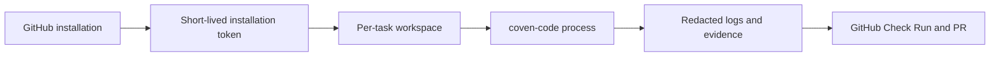

# Security Model

This document describes the security boundaries `coven-github` needs for self-hosted operators and the hosted OpenCoven service.

For the companion visual map of the installation, secret, worker, and task-history boundaries, see [Architecture Diagrams](architecture.md#trust-and-data-boundaries).

## GitHub App Credentials

`coven-github` authenticates as a GitHub App:

- The GitHub App private key signs short-lived JWTs.
- JWTs are exchanged for installation access tokens scoped to a specific installation.
- Installation tokens are used for repository clone, Check Runs, comments, and pull requests.
- User GitHub credentials are never required for worker pushes.

Self-hosted operators are responsible for storing the private key and webhook secret outside the repository. Hosted OpenCoven should store these in managed secret storage and rotate webhook secrets when an installation is reconfigured.

## Webhook Integrity

Every webhook request must include `X-Hub-Signature-256`. The receiver validates the HMAC over the raw request body before parsing JSON. Invalid or missing signatures are rejected before task routing.

Production hosted ingress should also add:

- Delivery ID idempotency with `X-GitHub-Delivery`.
- Rate limits by installation and repository.
- Structured audit logs for accepted, rejected, and duplicate deliveries.

## Worker Boundaries

Workers execute `coven-code --headless` using a per-task workspace. Current development workers use local directories and enforce task timeouts. Production hosted workers should run each task in an isolated container or sandbox.

Worker rules:

- Create one workspace per task.
- Pass only the installation token required for that repository.
- Clean up workspaces after task completion or failure.
- Enforce timeout and retry limits.
- Persist failure states before cleanup.

See [Container Isolation](container-isolation.md) for the production isolation target.

## Token Handling

The session brief is **tokenless**: it carries read context only and never embeds an installation token or a credentialed `clone_url`. Git authentication is injected into the `coven-code` child process out-of-band through the `COVEN_GIT_TOKEN` environment variable, which is never written to `session-brief.json` or any durable artifact. GitHub write authority (comments, Check Runs, branches, PRs) stays with the adapter behind its publication gate; the agent emits a result envelope and the adapter publishes. A serialization test fails if the brief ever serializes an `auth`/`token` field or an `x-access-token` clone URL.

Remaining hardening targets:

- Prefer `GIT_ASKPASS` / credential-helper injection over a plain env var so the token never appears in child process listings.
- Avoid writing installation tokens to durable task stores.
- Redact tokens in logs, Check Runs, issue comments, PR bodies, and task APIs.
- Refresh installation tokens through a single token manager with cache expiry.

## Tenant Data

Hosted OpenCoven should treat each GitHub installation as a tenant boundary.

Tenant-scoped data:

- Installation ID and repository list.
- Familiar routing config.
- Task history, status, branch, PR, and Check Run links.
- Optional familiar memory, if enabled by the customer.

The public task API must not return cross-installation data. The current in-memory `/api/github/tasks` path is suitable for local development and Cave polling, but hosted usage needs tenant-scoped authentication before launch.

## Model and Memory Boundaries

OpenCoven's strongest hosted differentiator is familiar identity plus memory. That also makes data boundaries explicit:

- BYOM keys should be installation-scoped or organization-scoped.
- Model routing choices should be visible to operators.
- Cloud familiar memory should be opt-in for hosted customers.
- Retention should be configurable by tier and organization policy.
- PR bodies should disclose the familiar identity and link back to the oversight session.

## Launch Gate

Before accepting paid hosted customers, the service should have:

- Durable task persistence.
- Delivery idempotency.
- Tenant-scoped task API auth.
- Worker timeout enforcement.
- Containerized or sandboxed worker execution.
- Secret redaction tests.
- A documented data retention policy.
