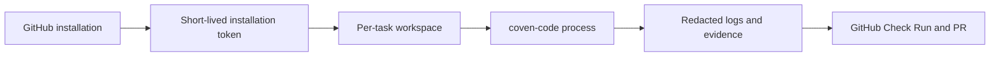

# Security Model

This document describes the security boundaries `coven-github` needs for self-hosted operators and the hosted OpenCoven service.

For the companion visual map of the installation, secret, worker, and task-history boundaries, see [Architecture Diagrams](architecture.md#trust-and-data-boundaries).

## GitHub App Credentials

`coven-github` authenticates as a GitHub App:

- The GitHub App private key signs short-lived JWTs.
- JWTs are exchanged for installation access tokens scoped to a specific installation.
- Installation tokens are used for repository clone, Check Runs, comments, and pull requests.
- User GitHub credentials are never required for worker pushes.

Self-hosted operators are responsible for storing the private key and webhook secret outside the repository. Hosted OpenCoven should store these in managed secret storage and rotate webhook secrets when an installation is reconfigured.

## Webhook Integrity

Every webhook request must include `X-Hub-Signature-256`. The receiver validates the HMAC over the raw request body before parsing JSON. Invalid or missing signatures are rejected before task routing.

Production hosted ingress should also add:

- Delivery ID idempotency with `X-GitHub-Delivery`.
- Rate limits by installation and repository.
- Structured audit logs for accepted, rejected, and duplicate deliveries.

## Worker Boundaries

Workers execute `coven-code --headless` using a per-task workspace. Current development workers use local directories and enforce task timeouts. Production hosted workers should run each task in an isolated container or sandbox.

Worker rules:

- Create one workspace per task.
- Pass the agent only a `contents:write` token scoped to that repository; orchestration and publication authority stay in the adapter.
- Clean up workspaces after task completion or failure.
- Enforce timeout and retry limits.
- Persist failure states before cleanup.

See [Container Isolation](container-isolation.md) for the production isolation target.

## Token Handling

The session brief is **tokenless**: it carries read context only and never embeds an installation token or a credentialed `clone_url`. A serialization test fails if the brief ever serializes an `auth`/`token` field or an `x-access-token` clone URL, and the worker refuses to write a brief containing a live token value.

Per task, the adapter mints **three separately-scoped installation tokens**, each constrained to the single target repository:

| Role | Permissions | Held by | Used for |
|---|---|---|---|
| Orchestration | `contents:read`, `checks:write`, `issues:write`, `pull_requests:read` | adapter | ref resolution, Check Run lifecycle, progress and needs-input comments |
| Agent git | `contents:write` | `coven-code` child (via `COVEN_GIT_TOKEN` env, never JSON) | clone/fetch and pushing the working branch — the contract's only permitted agent-side GitHub write |
| Publication | `contents:read`, `issues:write`, `pull_requests:write` | adapter, minted **after** the result envelope passes contract validation | opening the draft PR and the PR-opened comment |

Every free-text field of the result envelope is scanned and redacted (live token values, GitHub token patterns, `x-access-token` URLs) before it reaches the task store, comments, PR bodies, or Check Run output. Error strings embedded in published comments and Check Run summaries pass through the same redaction.

Remaining hardening targets:

- Contract v3: move the branch push into the adapter so the agent token can drop to read-only entirely (coordinated with coven-code).
- Prefer `GIT_ASKPASS` / credential-helper injection over a plain env var (a contract change; the env channel is locked in contract v2).
- Refresh installation tokens through a single token manager with cache expiry.

## Tenant Data

Hosted OpenCoven should treat each GitHub installation as a tenant boundary.

Tenant-scoped data:

- Installation ID and repository list.
- Familiar routing config.
- Task history, status, branch, PR, and Check Run links.
- Optional familiar memory, if enabled by the customer.

The public task API must not return cross-installation data. `/api/github/tasks` is gated by the `[api]` config section (issue #3): `mode = "open"` keeps it unauthenticated for local development and Cave polling — never expose that publicly — while `mode = "token"` fails closed and requires bearer tokens. A `service_token` grants the operator full visibility; each `[[api.tenants]]` token is scoped server-side to one installation id (optionally narrowed to specific repositories). Unauthorized calls receive a uniform `401 unauthorized` that reveals nothing about existing data, and every read — allowed or denied — is recorded in the store's `api_audit` table with caller, scope, action, and result.

## Model and Memory Boundaries

OpenCoven's strongest hosted differentiator is familiar identity plus memory. That also makes data boundaries explicit:

- BYOM keys should be installation-scoped or organization-scoped.
- Model routing choices should be visible to operators.
- Cloud familiar memory should be opt-in for hosted customers.
- Retention should be configurable by tier and organization policy.
- PR bodies should disclose the familiar identity and link back to the oversight session.

## Launch Gate

Before accepting paid hosted customers, the service should have:

- Durable task persistence.
- Delivery idempotency.
- Tenant-scoped task API auth.
- Worker timeout enforcement.
- Containerized or sandboxed worker execution.
- Secret redaction tests.
- A documented data retention policy.
